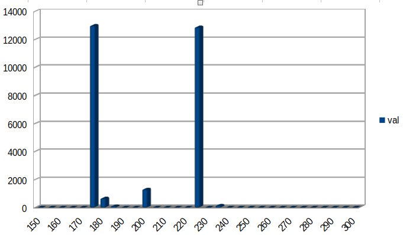
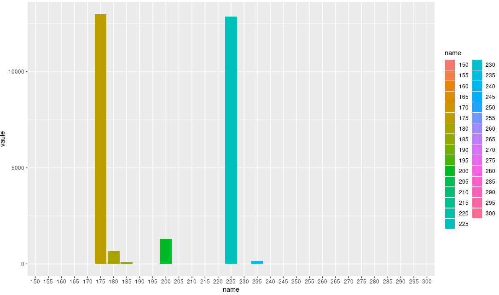
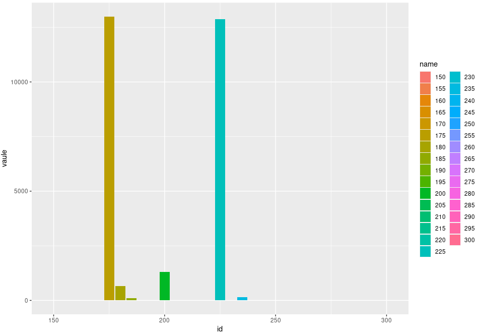

# Examples of ggplot2 and OpenOffice

## 2021-02-06
### Solution with LibreOffice



### Process with LibreOffice
`Click...click!`

### Solution with Tidyverse





### Process with Tidyverse
#### 1.Preliminaries with bash

```bash
id="150
155
160
165
170
175
180
185
190
195
200
205
210
215
220
225
230
235
240
245
250
255
260
265
270
275
280
285
290
295
300"
val="0
0
0
0
0
12980
664
100
0
0
1300
0
0
0
0
12870
0
150
0
0
0
0
0
0
0
0
0
0
0
0
0
"
echo "$id" | tr "\n " ","
#150,155,160,165,170,175,180,185,190,195,200,205,210,215,220,225,230,235,240,245,250,255,260,265,270,275,280,285,290,295,300
echo "$val" | tr "\n " ","
#0,0,0,0,0,12980,664,100,0,0,1300,0,0,0,0,12870,0,150,0,0,0,0,0,0,0,0,0,0,0,0,0
R
```

#### 2. R
```R
id=c(150,155,160,165,170,175,180,185,190,195,200,
205,210,215,220,225,230,235,240,245,250,255,260,265,270,275,280,285,290,295,300)
val=c(0,0,0,0,0,12980,664,100,0,0,1300,0,0,0,0,
12870,0,150,0,0,0,0,0,0,0,0,0,0,0,0,0)
data=tibble(id,name=as.factor(id),val)
ggplot(data=data,aes(x=name,y=vaule,fill=name)) + 
geom_bar(stat="identity")#All numbers
ggplot(data=data,aes(x=id,y=val,fill=name)) + 
geom_bar(stat="identity")
```
#### 3. Ugly colors
  - Don't you like these colors?
  - Take it easy, look at this link:
  [Here](https://www.r-bloggers.com/2013/09/how-to-expand-color-palette-with-ggplot-and-rcolorbrewer/)
